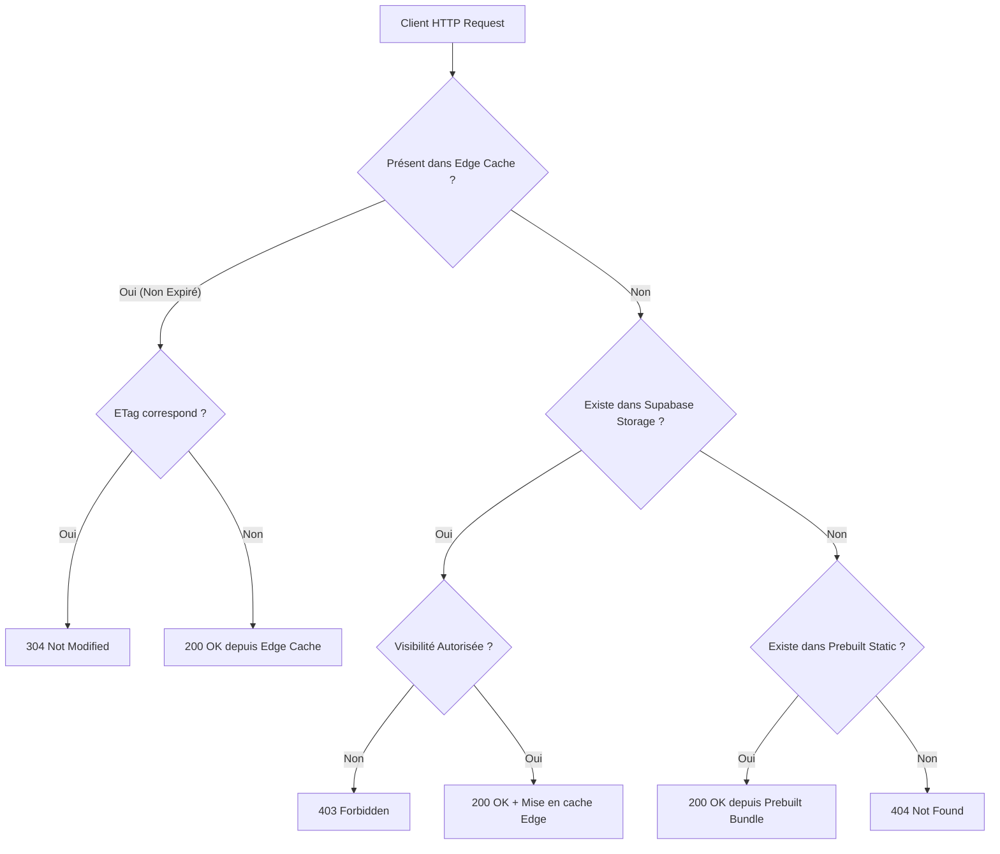

# Évaluation d'Architecture : Hébergement Statique Précompilé vs Rendu Dynamique depuis Supabase Storage

> **Contexte** : Issue [#53](https://github.com/JeanHuguesRobert/inseme/issues/53), en lien avec
> [#47](https://github.com/JeanHuguesRobert/inseme/issues/47) (Olé Olé portability) et
> [#52](https://github.com/JeanHuguesRobert/inseme/issues/52) (Agent JHN as coding-capable twin).

---

## 1. Problématique & Cas d'Usage

Dans l'écosystème Inseme / Fractanet, deux paradigmes d'hébergement s'opposent :

1. **Hébergement Statique Précompilé (ex. Cloudflare Pages / Netlify Static)** :
   - _Mécanisme_ : Les artefacts HTML/JS sont générés à la compilation par un humain ou un pipeline
     CI/CD (`pnpm build`).
   - _Avantages_ : Latence TTFB ultra-faible (<20ms sur CDN mondial), coût nul/minimal, résilience
     maximale.
   - _Limite bloquante pour l'IA autonome_ : Un agent cognitif (JHN / Ophélia) ne peut pas modifier
     la structure ou le contenu d'un site en direct sans déclencher un build et un redéploiement
     global.

2. **Rendu Dynamique depuis Supabase Storage (Edge Proxy)** :
   - _Mécanisme_ : Les agents génèrent ou modifient des artefacts (pages HTML, fragments de briques,
     visualisations) et les déposent directement dans un bucket Supabase Storage
     (`hosted-twin-artifacts`). Un adaptateur Edge léger (Deno / Cloudflare Worker / Netlify Edge)
     sert ces objets à la volée avec validation d'ETag et mise en cache mémoire.
   - _Avantages_ : **Déploiement instantané sans étape de build** (indispensable pour l'Agent JHN
     codant et personnalisant les Digital Twins en temps réel).
   - _Risques_ : Latence additionnelle à l'origine (fetch Storage ~100-200ms au cold start),
     consommation de bande passante/requêtes Supabase, nécessité d'un contrôle d'accès strict.

---

## 2. Contrainte d'Isolation de Données

- Le projet Supabase legacy Survey `opnotbjrbphwcezaqgim` (utilisé jadis par `lepp.fr`) **ne doit en
  aucun cas être réutilisé ni partagé**.
- Tout bucket dédié au service dynamique (`hosted-twin-artifacts`, `rendered-pages`) réside
  obligatoirement dans le projet Supabase unifié d'Agent John (`ndiysuhzmztatpxbkezn`).

---

## 3. Matrice Comparative des Solutions

| Critère                                | Statique Précompilé (Cloudflare Pages) | Dynamique Pur (Supabase Storage) | **Modèle Hybride Inseme (Recommandé)**            |
| :------------------------------------- | :------------------------------------- | :------------------------------- | :------------------------------------------------ |
| **Génération par Agent sans build**    | ❌ Impossible (nécessite CI/CD)        | ✅ Instantané (écriture Storage) | ✅ **Instantané** (Storage écrase le statique)    |
| **Latence TTFB (Cache chaud)**         | ⚡ ~15 ms                              | ⚡ ~20 ms (Edge cache mémoire)   | ⚡ **~15-20 ms**                                  |
| **Latence TTFB (Cache froid)**         | ⚡ ~30 ms                              | ⏱️ ~150-250 ms (fetch Storage)   | ⚡ **~30-150 ms**                                 |
| **Coût d'opération**                   | 🟢 Quasi-gratuit                       | 🟡 Requêtes API Storage Supabase | 🟢 **Amorti par l'Edge Cache (TTL 300s)**         |
| **Gouvernance & Contrôle d'Accès**     | 🔴 Tout est public ou gated global     | 🟢 RLS / Visibilité déclarée     | 🟢 **Visibilité fine (`public` vs `restricted`)** |
| **Résilience en cas de panne Storage** | 🟢 Totale                              | 🔴 Indisponibilité               | 🟢 **Repli automatique sur bundle statique**      |

---

## 4. Architecture de l'Adaptateur Hybride (`storageServingAdapter.js`)

### Invalidation Instantanée par l'Agent

Lorsqu'un agent produit un nouvel artefact ou résout un Cognitive Packet :

1. L'agent écrit dans le bucket Storage `hosted-twin-artifacts/pertitellu-corte/index.html`.
2. L'événement COP `cop.artifact.published` déclenche
   `adapter.invalidateCache("pertitellu-corte/index.html")`.
3. Le prochain visiteur reçoit immédiatement la nouvelle version générée sans attendre l'expiration
   du TTL.

---

## 5. Conclusion & Recommandation

- **Verdict sur la Question 1 (Olé Olé seul)** : Pour Olé Olé en tant que brique isolée, le statique
  précompilé suffit amplement.
- **Verdict sur la Question 2 (Plateforme globale & Agent JHN codant)** : Pour permettre aux Digital
  Twins et aux agents d'éditer et de personnaliser des interfaces civiques en direct (Issues #52,
  #57, #58), le **Modèle Hybride** implémenté via `DynamicStorageServingAdapter` est la solution
  optimale :
  - Il conserve la rapidité et la sécurité du statique pour le socle commun.
  - Il offre la plasticité instantanée du Storage pour les extensions générées par l'IA.
