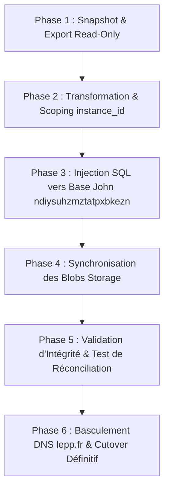

# Stratégie de Migration des Données — LePP (lepp.fr / Pertitellu-Corte)

> **Cadre** : Migration _one-shot_ de la production historique Survey (`opnotbjrbphwcezaqgim`) et
> des actifs spécifiques `lepp.fr` vers la plateforme Inseme hébergée sur la base Supabase d''Agent
> John (`ndiysuhzmztatpxbkezn`).

---

## 1. Périmètre & Typologie des Données

### A. Données GitHub (Continuité de référence)

- **Nature** : Dépôts de code, historiques de commits, Markdown de documentation et de briques.
- **Stratégie** : Aucun déplacement de données nécessaire. La table `git_sync_log` et le module
  `wikiFederation.js` continuent de pointer directement vers les URLs et hashes canoniques de
  GitHub.

---

### B. Données Supabase (Base relationnelle & Stockage Blobs)

- **Source** : Projet Supabase legacy `opnotbjrbphwcezaqgim`.
- **Cible** : Projet Supabase Agent John `ndiysuhzmztatpxbkezn`, sous
  `instance_id = '00000000-0000-0000-0000-000000000010'` (`pertitellu-corte`).

#### 1. Tables SQL Relationnelles :

| Table Source                       | Table Cible Inseme                        | Stratégie de Transformation                                                                                                                                  |
| :--------------------------------- | :---------------------------------------- | :----------------------------------------------------------------------------------------------------------------------------------------------------------- |
| `public.users`                     | `public.users`                            | Conservation stricte des UUID `id`, synchronisation avec `auth.users`, préservation des consentements RGPD et rôles.                                         |
| `public.wiki_pages`                | `public.wiki_pages`                       | Injection sous `instance_id = pertitellu-corte`, génération des tokens FTS français via trigger, conservation de `slug`, `author_id`, `summary`, `metadata`. |
| `public.propositions`              | `public.propositions`                     | Migration avec `instance_id = pertitellu-corte`, statut (`active`, `closed`, `draft`), conservation des UUIDs.                                               |
| `public.tags` & `proposition_tags` | `public.tags` & `public.proposition_tags` | Migration des catégories thématiques et associations.                                                                                                        |
| `public.votes`                     | `public.votes`                            | Import des votes directs avec déduplication stricte `(user_id, proposition_id)`.                                                                             |
| `public.delegations`               | `public.delegations`                      | Import des délégations liquides avec validation `delegator_id <> delegate_id`.                                                                               |
| `public.acte` & `demande_admin`    | `public.acte` & `public.demande_admin`    | Actes municipaux et dossiers administratifs de Corte.                                                                                                        |
| `public.posts` & `comments`        | `public.posts` & `public.comments`        | Fils de discussion et commentaires du café citoyen.                                                                                                          |

#### 2. Storage Buckets :

| Bucket Source                  | Destination / Équivalent Cible                         | Volume & Contenu                                                         |
| :----------------------------- | :----------------------------------------------------- | :----------------------------------------------------------------------- |
| `wiki-content` / `wiki-images` | Bucket `wiki-content` sur `ndiysuhzmztatpxbkezn`       | Images et illustrations des fiches Wiki.                                 |
| `documents` / `proofs`         | Bucket `proofs` + miroir local `public/docs/officiel/` | 41 fichiers PDF originaux des délibérations et convocations (2023-2025). |
| `avatars`                      | Bucket `avatars`                                       | Photos de profil des utilisateurs.                                       |

---

### C. Données & Actifs Spécifiques à `lepp.fr` (Hors Supabase / GitHub)

1. **DNS & Reverse Proxy (Caddy / Let''s Encrypt)** :
   - Zone DNS `lepp.fr` et sous-domaines (`www.lepp.fr`).
   - Fragment Caddy configuré pour router le trafic vers le runtime Fracta Preview (port `8893`)
     puis production.
2. **Identité Visuelle & Métadonnées Statiques** :
   - Logo LePP, favicon SVG (`images/favicon.svg`), images de partage social OpenGraph
     (`images/og-image.png`).
3. **Corpus Documentaire Consolidé** :
   - Fiche d''identité communale : `apps/platform/public/docs/fiche_identité_corte.md` (40 Ko).
   - Corpus sémantique des conseils municipaux :
     `apps/platform/public/docs/conseils/conseil-consolidated.md` (503 Ko),
     `conseil-consolidated.semantic.json` (165 Ko).
   - Charte de transparence municipale et guide citoyen des actes.
4. **Paramétrage Vault & Identifiants Tiers** :
   - Contact email : `contact@lepp.fr`.
   - Coordonnées géographiques de Corte : `[42.3084, 9.1505]`, Code INSEE : `2B096`.
   - Facebook App ID / OAuth si applicables.

---

## 2. Procédure d''Exécution One-Shot

1. **Snapshot Read-Only** :
   - L''ancien projet `opnotbjrbphwcezaqgim` est exporté en lecture seule (pg_dump / script
     d''extraction JSON).
2. **Scoping & Re-mappage** :
   - Ajout de la clé `instance_id = '00000000-0000-0000-0000-000000000010'` sur toutes les entités.
   - Validation de non-collision avec les Digital Twins existants de John.
3. **Chargement dans la base d''Agent John** :
   - Exécution du script de chargement avec contrôle d''intégrité des clés étrangères.
4. **Validation sémantique & Replay** :
   - Vérification que la consultation des propositions, du Wiki et des votes fonctionne
     immédiatement sous l''interface Inseme.
5. **Basculement DNS** :
   - Modification de l''enregistrement A/CNAME de `lepp.fr` vers le serveur Fracta/Inseme.
