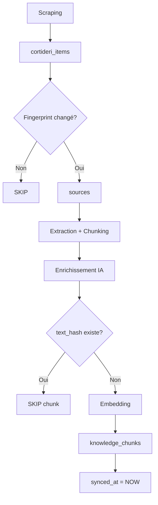

# Architecture RAG - Modélisation et Ingestion

## 1. Modélisation des connaissances

### 1.1. Unité de base : le "chunk"

Un **chunk** = un petit bloc de texte autonome et contextualisé.

**Structure d'un chunk :**

```
TYPE: fact | allegation | opinion
STATUT: under_review | confirmed | refuted | obsolete
DATE: 2024-03-15
SOURCE: Conseil Municipal de Corte

[CONTENU du chunk]
```

**Champs structurés (colonnes SQL) :**

| Champ         | Type  | Description                                                   |
| ------------- | ----- | ------------------------------------------------------------- |
| `type`        | enum  | `fact`, `allegation`, `opinion`                               |
| `status`      | enum  | `under_review`, `confirmed`, `refuted`, `obsolete`            |
| `source_type` | text  | `official`, `wiki`, `history`, `proposal`, `comment`, `forum` |
| `domain`      | text  | `civics`, `history`, `budget`, `urbanisme`, `cadastre`        |
| `territory`   | text  | `Corte`, `Corse`, etc.                                        |
| `info_date`   | date  | Date logique de l'événement                                   |
| `layer`       | enum  | `hot`, `summary`, `archive`                                   |
| `meta`        | jsonb | `{topic, tags, actors, kind_of_content, ...}`                 |

**Indexation :**

- Plein texte : `to_tsvector(text)`
- Vecteur sémantique : `embedding vector(1536)`

### 1.2. Principe Append-Only

> **On n'édite jamais les anciens chunks. On ajoute.**

**Exemple :**

```
2025 → TYPE: ALLEGATION, STATUS: UNDER_REVIEW
"L'association X accuse la mairie d'irrégularités sur le marché Y."

2026 → TYPE: FACT, STATUS: CONFIRMED
"Le jugement du TGI dit qu'aucune irrégularité n'est établie."
```

Les deux chunks coexistent. Le RAG + prompt guide l'IA pour présenter :

- L'allégation comme telle
- Le jugement comme fait confirmé

**Consolidation = au moment de la requête**, pas en base.

### 1.3. Niveaux / Domaines

**Dimension thématique (domain) :**

- `civics` : vie municipale, PV, délibérations, budgets
- `history` : Corti d'Eri, patrimoine
- `cadastre`, `urbanisme` (futurs)

**Dimension de fiabilité (source_type) :**

- `official` : mairie, préfecture, textes réglementaires
- `history` / `cortideri` : histoire locale
- `wiki`, `proposal` : synthèses internes
- `comment`, `forum` : points de vue citoyens

---

## 2. Ingestion et mise à jour

### 2.1. Niveau document : table `sources`

**Rôle :** Registre des documents bruts.

**Colonnes clés :**

- `external_id` : identifiant d'origine (URL, `cortideri:post_id`, etc.)
- `fingerprint` : SHA-256 du contenu normalisé
- `source_type`, `domain`, `territory`
- `meta` : URL, titre, tags
- `last_seen_at`, `last_processed_at`

**Stratégie d'import :**

```
1. Recalculer fingerprint du document
2. Si fingerprint identique → SKIP (idempotence)
3. Si fingerprint différent :
   - Mettre à jour sources (fingerprint, last_seen_at)
   - Relancer extraction + chunking
```

**Tables de staging (ex: `cortideri_items`) :**

- Recensent les documents collectés (scraping)
- Pointent vers `sources.id`
- Indiquent ce qui a été transformé en chunks (`synced_at`)

### 2.2. Niveau chunk : table `knowledge_chunks`

**Pipeline d'ingestion :**

#### Étape 1 : Extraction + Chunking

```
Document brut → Texte → Découpage en chunks cohérents
```

Exemples :

- Convocation → 1 chunk contexte + 1 chunk par point d'ODJ
- Billet Corti d'Eri → 1 chunk par billet

#### Étape 2 : BaseMeta déterministe

```javascript
{
  source_type: "official" | "history" | ...,
  domain: "civics" | "history" | ...,
  territory: "Corte",
  info_date: "2024-03-15",
  source: "Conseil Municipal de Corte"
}
```

#### Étape 3 : Enrichissement par IA (optionnel)

```
LLM propose → {topic, tags, actors, kind_of_content, type_guess, legal_cues}

Code décide → {type, status} selon règles + signaux
```

#### Étape 4 : Construction du texte + Déduplication

```javascript
// 1. Construire le texte avec en-tête
const text = `TYPE: ${type}
STATUT: ${status}
DATE: ${info_date}
SOURCE: ${source}

${content}`;

// 2. Normaliser et hasher
const text_hash = sha256(normalize(text));

// 3. Vérifier si existe déjà
const exists = await db.query(
  'SELECT id FROM knowledge_chunks WHERE text_hash = $1 AND source_type = $2',
  [text_hash, source_type]
);

// 4. Si nouveau → insérer
if (!exists) {
  const embedding = await generateEmbedding(text);
  await db.insert('knowledge_chunks', {
    text, text_hash, embedding, type, status, ...
  });
}
```

#### Étape 5 : Mise à jour de la staging

```sql
UPDATE cortideri_items
SET source_id = $1, synced_at = NOW()
WHERE post_id = $2;
```

---

## 3. Mise à jour logique vs physique

### Physique (éviter les doublons)

- **`sources`** : Ne retraite que si `fingerprint` changé
- **`knowledge_chunks`** : Ne ré-insère pas si `text_hash` identique

### Logique (append-only)

- Nouvelle info → nouveau chunk
- Ancien chunk → reste (ou `layer = 'archive'`)

### Cohérence temporelle

Assurée par :

1. `info_date` (tri chronologique)
2. `type` / `status` (filtres)
3. RAG + prompt :
   - Privilégier faits confirmés récents
   - Présenter allégations comme telles
   - Distinguer opinions

---

## 4. Schéma SQL (résumé)

```sql
-- Documents sources
CREATE TABLE sources (
  id uuid PRIMARY KEY,
  external_id text UNIQUE,
  fingerprint text,
  source_type text,
  domain text,
  territory text,
  meta jsonb,
  last_seen_at timestamptz,
  last_processed_at timestamptz
);

-- Chunks de connaissance
CREATE TABLE knowledge_chunks (
  id uuid PRIMARY KEY,
  source_id uuid REFERENCES sources(id),
  text text,
  text_hash text,
  embedding vector(1536),
  type text CHECK (type IN ('fact', 'allegation', 'opinion')),
  status text CHECK (status IN ('under_review', 'confirmed', 'refuted', 'obsolete')),
  source_type text,
  domain text,
  territory text,
  info_date date,
  layer text CHECK (layer IN ('hot', 'summary', 'archive')),
  meta jsonb,
  created_at timestamptz DEFAULT now()
);

CREATE INDEX ON knowledge_chunks USING GIN (to_tsvector('french', text));
CREATE INDEX ON knowledge_chunks USING ivfflat (embedding vector_cosine_ops);
CREATE UNIQUE INDEX ON knowledge_chunks (text_hash, source_type);

-- Staging (exemple)
CREATE TABLE cortideri_items (
  id bigint PRIMARY KEY,
  post_id bigint UNIQUE,
  source_id uuid REFERENCES sources(id),
  synced_at timestamptz,
  -- ... autres champs
);
```

---

## 5. Workflow complet


