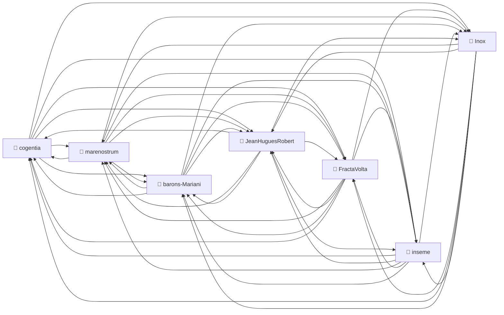

# Corpus Status — inseme

_Auto-refreshed by `cogentia.js corpus-status`. The structural sections_ — _Registered Repositories,
Cross-Reference Graph, Published, What Remains Possible_ — _are regenerated from the registry and
from [`research/index.md`](index.md) on every run._ _The substantive sections_ — _What Is Proved_
_and_ _Open Objections_ — _are manually curated and preserved across refreshes._

---

## Registered Repositories

<!-- BEGIN_AUTO: registered_repos -->
| Repository | research/index.md | Branch | Last commit |
|---|---|---|---|
| cogentia | ✅ | main | 2026-06-08 |
| FractaVolta | ✅ | main | 2026-06-08 |
| marenostrum | ✅ | main | 2026-06-08 |
| barons-Mariani | ✅ | main | 2026-06-08 |
| inseme | ✅ | main | 2026-06-08 |
| Inox | ✅ | master | 2026-06-08 |
| JeanHuguesRobert | ✅ | main | 2026-06-08 |
<!-- END_AUTO: registered_repos -->

---

## Cross-Reference Graph

<!-- BEGIN_AUTO: graph -->

<!-- END_AUTO: graph -->

---

## Concepts

<!-- BEGIN_AUTO: concepts -->
| Concept | Scope | Status | Type |
|---|---|---|---|
| [Cogentia](./concepts.md#cogentia) | — | — | abstract concept / agentivity class **Scope:** Global **Status:** Working |
| [Cogentigram](./concepts.md#cogentigram) | — | — | representation / map **Scope:** Global **Status:** Working |
| [COP (Continuous Operation Protocol)](./concepts.md#cop-continuous-operation-protocol) | — | — | protocol / runtime **Scope:** Global **Status:** Canonical |
| [Briques](./concepts.md#briques) | — | — | modular component **Scope:** Global **Status:** Operational |
| [Kudocracy](./concepts.md#kudocracy) | — | — | governance system **Scope:** Global **Status:** Defined |
| [Agora](./concepts.md#agora) | — | — | system model **Scope:** Global **Status:** Defined |
| [Ophélia](./concepts.md#ophelia) | — | — | agent **Scope:** Global **Status:** Operational |
| [COP Invariants](./concepts.md#cop-invariants) | — | — | protocol constraints / architectural invariants **Scope:** Global **Status:** Canonical |
| [Non-deterministic Cognitive Step (Agentic Step)](./concepts.md#non-deterministic-cognitive-step-agentic-step) | — | — | process concept **Scope:** Global **Status:** Working |
| [Human Enacted Decision Artifact](./concepts.md#human-enacted-decision-artifact) | — | — | artifact type / imputability anchor **Scope:** Global **Status:** Working |
| [Causal Trace Replay (Auditable Causal Reconstruction)](./concepts.md#causal-trace-replay-auditable-causal-reconstruction) | — | — | audit / replay mechanism **Scope:** Global **Status:** Working |
| [COP (Cognitive Orchestration Protocol)](./concepts.md#cop-cognitive-orchestration-protocol) | — | — | protocol / runtime **Scope:** Global **Status:** Canonical |
| [Brique Spec / Multi-Instance](./concepts.md#brique-spec-multi-instance) | — | — | technical specification **Scope:** project-specific **Status:** Defined |
| [Modular System](./concepts.md#modular-system) | — | — | frontend architecture **Scope:** repository-specific **Status:** Working |
<!-- END_AUTO: concepts -->

## Concept Graph

```mermaid
graph LR
  c_machine_a_explorer["Machine à explorer"]
  c_machine_a_empecher["Machine à empêcher"]
  c_effet_ubik["Effet Ubik"]
  c_stabilisateurs_anti_ubik_proceduraux["Stabilisateurs (anti-Ubik / procéduraux)"]
  c_cogentia["Cogentia"]
  c_cogentigram["Cogentigram"]
  c_continuation_protocol["Continuation Protocol"]
  c_non_deterministic_cognitive_step_agentic_step["Non-deterministic Cognitive Step (Agentic Step)"]
  c_human_enacted_decision_artifact["Human Enacted Decision Artifact"]
  c_causal_trace_replay_auditable_causal_reconstruction["Causal Trace Replay (Auditable Causal Reconstruction)"]
  c_cognitive_packet["Cognitive Packet"]
  c_cogentia_commons["Cogentia Commons"]
  c_cogentia_pipeline["Cogentia Pipeline"]
  c_derived_product["Derived Product"]
  c_agent_resumable_cli["Agent-Resumable CLI"]
  c_infrastructure_is_all_you_need["Infrastructure is All You Need"]
  c_possibilism["Possibilism"]
  c_territoires_possibilistes["Territoires Possibilistes"]
  c_autonomie_de_capacite["Autonomie de capacité"]
  c_kudocracy["Kudocracy"]
  c_kudos["Kudos"]
  c_pathologie_du_secret["Pathologie du secret"]
  c_the_second_method["The Second Method"]
  c_cop_invariants["COP Invariants"]
  c_concatenative_language["Concatenative language"]
  c_stack_vm["Stack VM"]
  c_controldata_plane_separation["Control/data plane separation"]
  c_named_values["Named values"]
  c_actors["Actors"]
  c_fractanet["Fractanet"]
  c_possibilism --> c_machine_a_explorer
  c_democratic_ai_safety["democratic ai safety"]
  c_democratic_ai_safety --> c_machine_a_explorer
  c_cogentia_commons_declinaison_manuelle["cogentia commons declinaison manuelle"]
  c_machine_a_explorer --> c_cogentia_commons_declinaison_manuelle
  c_fractanet_cop_declinaison_automatisee["fractanet cop declinaison automatisee"]
  c_machine_a_explorer --> c_fractanet_cop_declinaison_automatisee
  c_stabilisateurs_anti_ubik["stabilisateurs anti ubik"]
  c_machine_a_explorer --> c_stabilisateurs_anti_ubik
  c_machine_a_explorer -.-> c_continuation_protocol
  c_machine_a_explorer -.-> c_cognitive_packet
  c_dhitl_couches_45["dhitl couches 45"]
  c_machine_a_explorer -.-> c_dhitl_couches_45
  c_effet_ubik_oppose["effet ubik oppose"]
  c_machine_a_explorer -.-> c_effet_ubik_oppose
  c_machine_a_empecher -.-> c_effet_ubik
  c_machine_a_explorer_oppose_symetrique["machine a explorer oppose symetrique"]
  c_machine_a_empecher -.-> c_machine_a_explorer_oppose_symetrique
  c_fm_11_outer_optimizer_capture["fm 11 outer optimizer capture"]
  c_machine_a_empecher -.-> c_fm_11_outer_optimizer_capture
  c_concentration_de_compute_85_frontier["concentration de compute 85 frontier"]
  c_machine_a_empecher -.-> c_concentration_de_compute_85_frontier
  c_effet_ubik -.-> c_stabilisateurs_anti_ubik
  c_effet_ubik -.-> c_pathologie_du_secret
  c_invidia_densite_sociale_destructrice["invidia densite sociale destructrice"]
  c_effet_ubik -.-> c_invidia_densite_sociale_destructrice
  c_machine_a_explorer --> c_stabilisateurs_anti_ubik_proceduraux
  c_stabilisateurs_anti_ubik_proceduraux -.-> c_effet_ubik
  c_stabilisateurs_anti_ubik_proceduraux -.-> c_continuation_protocol
  c_stabilisateurs_anti_ubik_proceduraux -.-> c_cognitive_packet
  c_dhitl_compute_exergy_comme_unite_tracable["dhitl compute exergy comme unite tracable"]
  c_stabilisateurs_anti_ubik_proceduraux -.-> c_dhitl_compute_exergy_comme_unite_tracable
  c_cogentia --> c_cogentigram
  c_map_vs_territory["map vs territory"]
  c_cogentigram -.-> c_map_vs_territory
  c_operational_memory["operational memory"]
  c_cogentigram -.-> c_operational_memory
  c_traceable_agency["traceable agency"]
  c_cogentigram -.-> c_traceable_agency
  c_agent_resumable_cli --> c_continuation_protocol
  c_non_deterministic_cognitive_step["non deterministic cognitive step"]
  c_continuation_protocol -.-> c_non_deterministic_cognitive_step
  c_continuation_protocol -.-> c_human_enacted_decision_artifact
  c_causal_trace_replay["causal trace replay"]
  c_continuation_protocol -.-> c_causal_trace_replay
  c_machine_a_explorer --> c_non_deterministic_cognitive_step_agentic_step
  c_non_deterministic_cognitive_step_agentic_step -.-> c_human_enacted_decision_artifact
  c_non_deterministic_cognitive_step_agentic_step -.-> c_causal_trace_replay
  c_non_deterministic_cognitive_step_agentic_step -.-> c_continuation_protocol
  c_machine_a_explorer --> c_human_enacted_decision_artifact
  c_cophitl_profile["cophitl profile"]
  c_cophitl_profile --> c_human_enacted_decision_artifact
  c_human_enacted_decision_artifact -.-> c_non_deterministic_cognitive_step
  c_rule_0_seconde_methode["rule 0 seconde methode"]
  c_human_enacted_decision_artifact -.-> c_rule_0_seconde_methode
  c_dhitl_layer_5["dhitl layer 5"]
  c_human_enacted_decision_artifact -.-> c_dhitl_layer_5
  c_cop_invariants --> c_causal_trace_replay_auditable_causal_reconstruction
  c_machine_a_explorer --> c_causal_trace_replay_auditable_causal_reconstruction
  c_causal_trace_replay_auditable_causal_reconstruction -.-> c_continuation_protocol
  c_causal_trace_replay_auditable_causal_reconstruction -.-> c_non_deterministic_cognitive_step
  c_continuation_protocol --> c_cognitive_packet
  c_agent_resumable_cli --> c_cognitive_packet
  c_envelope_kind_agnostic_metadata_layer["envelope kind agnostic metadata layer"]
  c_cognitive_packet --> c_envelope_kind_agnostic_metadata_layer
  c_payload_kind_specific_content_layer["payload kind specific content layer"]
  c_cognitive_packet --> c_payload_kind_specific_content_layer
  c_continuation_payload["continuation payload"]
  c_cognitive_packet --> c_continuation_payload
  c_objection_payload["objection payload"]
  c_cognitive_packet --> c_objection_payload
  c_hypothesis_payload["hypothesis payload"]
  c_cognitive_packet --> c_hypothesis_payload
  c_decision_payload["decision payload"]
  c_cognitive_packet --> c_decision_payload
  c_failure_payload["failure payload"]
  c_cognitive_packet --> c_failure_payload
  c_routing_payload["routing payload"]
  c_cognitive_packet --> c_routing_payload
  c_cognitive_packet -.-> c_cogentia_commons
  c_cogentia_commons --> c_cogentia_pipeline
  c_cognitive_packet --> c_cogentia_pipeline
  c_source_document["source document"]
  c_cogentia_pipeline --> c_source_document
  c_cogentia_pipeline --> c_derived_product
  c_derived_product -.-> c_source_document
  c_traceable_agency --> c_cogentia
  c_cogentia --> c_operational_memory
  c_dhitl["dhitl"]
  c_dhitl --> c_infrastructure_is_all_you_need
  c_possibilism --> c_autonomie_de_capacite
  c_capabilities_approach_sen_nussbaum["capabilities approach sen nussbaum"]
  c_capabilities_approach_sen_nussbaum --> c_autonomie_de_capacite
  c_specificite_de_phase["specificite de phase"]
  c_autonomie_de_capacite --> c_specificite_de_phase
  c_flexibilite_dusage_redistributive_vs_predatory["flexibilite dusage redistributive vs predatory"]
  c_autonomie_de_capacite --> c_flexibilite_dusage_redistributive_vs_predatory
  c_autonomie_de_capacite -.-> c_territoires_possibilistes
  c_auto_institution_democratique_castoriadis["auto institution democratique castoriadis"]
  c_autonomie_de_capacite -.-> c_auto_institution_democratique_castoriadis
  c_possibilism --> c_kudocracy
  c_auto_institution_democratique_castoriadis --> c_kudocracy
  c_kudocracy -.-> c_autonomie_de_capacite
  c_kudocracy -.-> c_kudos
  c_kudocracy -.-> c_pathologie_du_secret
  c_kudocracy -.-> c_cognitive_packet
  c_possibilism --> c_kudos
  c_communs_ostrom["communs ostrom"]
  c_communs_ostrom --> c_kudos
  c_kudos -.-> c_kudocracy
  c_kudos -.-> c_autonomie_de_capacite
  c_mauss_gift_counter_gift["mauss gift counter gift"]
  c_kudos -.-> c_mauss_gift_counter_gift
  c_democratic_ai_safety_thesis_kernel["democratic ai safety thesis kernel"]
  c_democratic_ai_safety_thesis_kernel --> c_pathologie_du_secret
  c_the_second_method --> c_pathologie_du_secret
  c_dhitl_democratic_humans_in_the_loop["dhitl democratic humans in the loop"]
  c_pathologie_du_secret -.-> c_dhitl_democratic_humans_in_the_loop
  c_cogentia_commons_auditable_knowledge["cogentia commons auditable knowledge"]
  c_pathologie_du_secret -.-> c_cogentia_commons_auditable_knowledge
  c_tracabilite_civique_anti_mafieuse["tracabilite civique anti mafieuse"]
  c_pathologie_du_secret -.-> c_tracabilite_civique_anti_mafieuse
  c_machine_a_explorer --> c_cop_invariants
  c_stabilisateurs_anti_ubik_proceduraux --> c_cop_invariants
  c_deterministic_replay_protocol_layer_only["deterministic replay protocol layer only"]
  c_causal_trace_replay_auditable_causal_reconstruction -.-> c_deterministic_replay_protocol_layer_only
  c_concatenative_language -.-> c_stack_vm
  c_concatenative_language -.-> c_named_values
  c_stack_vm -.-> c_concatenative_language
  c_stack_vm -.-> c_controldata_plane_separation
  c_stack_vm -.-> c_named_values
  c_energy_packet_network_fractavolta["energy packet network fractavolta"]
  c_controldata_plane_separation -.-> c_energy_packet_network_fractavolta
  c_cognitive_packet_envelopepayload_cogentia["cognitive packet envelopepayload cogentia"]
  c_controldata_plane_separation -.-> c_cognitive_packet_envelopepayload_cogentia
  c_fractanet -.-> c_energy_packet_network_fractavolta
  c_auxilia_inseme_brique_human_scale_fractanet_exchange["auxilia inseme brique human scale fractanet exchange"]
  c_fractanet -.-> c_auxilia_inseme_brique_human_scale_fractanet_exchange
  c_fractanet -.-> c_actors
  click c_machine_a_explorer "https://github.com/JeanHuguesRobert/cogentia/blob/main/research/concepts.md#machine-a-explorer" "Open Machine à explorer"
  click c_machine_a_empecher "https://github.com/JeanHuguesRobert/cogentia/blob/main/research/concepts.md#machine-a-empecher" "Open Machine à empêcher"
  click c_effet_ubik "https://github.com/JeanHuguesRobert/cogentia/blob/main/research/concepts.md#effet-ubik" "Open Effet Ubik"
  click c_stabilisateurs_anti_ubik_proceduraux "https://github.com/JeanHuguesRobert/cogentia/blob/main/research/concepts.md#stabilisateurs-anti-ubik-proceduraux" "Open Stabilisateurs (anti-Ubik / procéduraux)"
  click c_cogentia "https://github.com/JeanHuguesRobert/FractaVolta/blob/main/research/concepts.md#cogentia" "Open Cogentia"
  click c_cogentigram "https://github.com/JeanHuguesRobert/cogentia/blob/main/research/concepts.md#cogentigram" "Open Cogentigram"
  click c_continuation_protocol "https://github.com/JeanHuguesRobert/cogentia/blob/main/research/concepts.md#continuation-protocol" "Open Continuation Protocol"
  click c_non_deterministic_cognitive_step_agentic_step "https://github.com/JeanHuguesRobert/cogentia/blob/main/research/concepts.md#non-deterministic-cognitive-step-agentic-step" "Open Non-deterministic Cognitive Step (Agentic Step)"
  click c_human_enacted_decision_artifact "https://github.com/JeanHuguesRobert/cogentia/blob/main/research/concepts.md#human-enacted-decision-artifact" "Open Human Enacted Decision Artifact"
  click c_causal_trace_replay_auditable_causal_reconstruction "https://github.com/JeanHuguesRobert/cogentia/blob/main/research/concepts.md#causal-trace-replay-auditable-causal-reconstruction" "Open Causal Trace Replay (Auditable Causal Reconstruction)"
  click c_cognitive_packet "https://github.com/JeanHuguesRobert/cogentia/blob/main/research/concepts.md#cognitive-packet" "Open Cognitive Packet"
  click c_cogentia_commons "https://github.com/JeanHuguesRobert/cogentia/blob/main/research/concepts.md#cogentia-commons" "Open Cogentia Commons"
  click c_cogentia_pipeline "https://github.com/JeanHuguesRobert/cogentia/blob/main/research/concepts.md#cogentia-pipeline" "Open Cogentia Pipeline"
  click c_derived_product "https://github.com/JeanHuguesRobert/cogentia/blob/main/research/concepts.md#derived-product" "Open Derived Product"
  click c_agent_resumable_cli "https://github.com/JeanHuguesRobert/cogentia/blob/main/research/concepts.md#agent-resumable-cli" "Open Agent-Resumable CLI"
  click c_infrastructure_is_all_you_need "https://github.com/JeanHuguesRobert/marenostrum/blob/main/research/concepts.md#infrastructure-is-all-you-need" "Open Infrastructure is All You Need"
  click c_possibilism "https://github.com/JeanHuguesRobert/barons-Mariani/blob/main/research/concepts.md#possibilism" "Open Possibilism"
  click c_territoires_possibilistes "https://github.com/JeanHuguesRobert/barons-Mariani/blob/main/research/concepts.md#territoires-possibilistes" "Open Territoires Possibilistes"
  click c_autonomie_de_capacite "https://github.com/JeanHuguesRobert/barons-Mariani/blob/main/research/concepts.md#autonomie-de-capacite" "Open Autonomie de capacité"
  click c_kudocracy "https://github.com/JeanHuguesRobert/barons-Mariani/blob/main/research/concepts.md#kudocracy" "Open Kudocracy"
  click c_kudos "https://github.com/JeanHuguesRobert/barons-Mariani/blob/main/research/concepts.md#kudos" "Open Kudos"
  click c_pathologie_du_secret "https://github.com/JeanHuguesRobert/barons-Mariani/blob/main/research/concepts.md#pathologie-du-secret" "Open Pathologie du secret"
  click c_the_second_method "https://github.com/JeanHuguesRobert/barons-Mariani/blob/main/research/concepts.md#the-second-method" "Open The Second Method"
  click c_cop_invariants "https://github.com/JeanHuguesRobert/inseme/blob/main/research/concepts.md#cop-invariants" "Open COP Invariants"
  click c_concatenative_language "https://github.com/JeanHuguesRobert/Inox/blob/main/research/concepts.md#concatenative-language" "Open Concatenative language"
  click c_stack_vm "https://github.com/JeanHuguesRobert/Inox/blob/main/research/concepts.md#stack-vm" "Open Stack VM"
  click c_controldata_plane_separation "https://github.com/JeanHuguesRobert/Inox/blob/main/research/concepts.md#controldata-plane-separation" "Open Control/data plane separation"
  click c_named_values "https://github.com/JeanHuguesRobert/Inox/blob/main/research/concepts.md#named-values" "Open Named values"
  click c_actors "https://github.com/JeanHuguesRobert/Inox/blob/main/research/concepts.md#actors" "Open Actors"
  click c_fractanet "https://github.com/JeanHuguesRobert/Inox/blob/main/research/concepts.md#fractanet" "Open Fractanet"
```

<!-- BEGIN_AUTO: concept_graph -->

*Orphan concepts (no parents / children / related): `Civilizational Stakes` (cogentia), `Sovereign Digital Twin` (cogentia), `Kernel Extractor` (cogentia), `KYS (Know Your System) / Psychocognitive Analysis` (cogentia), `Cogentia Workflows` (cogentia), `IPN (Inference Packet Network)` (FractaVolta), `EPN (Energy Packet Network)` (FractaVolta), `PGN (Power Generation Node)` (FractaVolta), `Packet Attractors` (FractaVolta), `The Unconscious Grid` (FractaVolta), `Mariani Village` (FractaVolta), `Value-Shaped Solar` (FractaVolta), `Containerized Compute (Tera)` (FractaVolta), `Traceable Governance` (FractaVolta), `DHITL (Democratic Human In The Loop)` (marenostrum), `CXU (Compute and Exergy Unit)` (marenostrum), `Safe Compute Exergy` (marenostrum), `Constellia` (marenostrum), `Corsica Forest Synergies` (marenostrum), `Sun to Sovereignty` (marenostrum), `Potentics` (barons-Mariani), `Cognitive Waves` (barons-Mariani), `Mimetic Desynchronization` (barons-Mariani), `Invidia` (barons-Mariani), `Transition Markets` (barons-Mariani), `The Uchronian Museum` (barons-Mariani), `Projet Minesteggio` (barons-Mariani), `Discret Holography` (barons-Mariani), `COP (Continuous Operation Protocol)` (inseme), `Briques` (inseme), `Agora` (inseme), `Ophélia` (inseme), `COP (Cognitive Orchestration Protocol)` (inseme), `Brique Spec / Multi-Instance` (inseme), `Modular System` (inseme), `Reactive sets` (Inox), `Dialects` (Inox). Re-include with `--include-orphans`.*
<!-- END_AUTO: concept_graph -->

---

## Published in this repo

<!-- BEGIN_AUTO: published -->
| Title | Location | Date |
|---|---|---|
| [Lien avec C.O.R.S.I.C.A. et l’Institut Mariani](acorsica-institut-mariani.md) _(institutional boundary note — Inseme, C.O.R.S.I.C.A. and Institut Mariani)_                                                                                                                                                        | this repo | 2026-06-03  |
| [COP — Cognitive Orchestration Protocol (Architecture)](../packages/cop-core/Architecture.md) _(canonical protocol spec)_                                                                                                                                                                                           | this repo | 2025-12     |
| [COP Invariants — non-negotiable rules of the protocol](../packages/cop-core/Invariants.md)                                                                                                                                                                                                                         | this repo | 2025-12     |
| [COP Manifesto](../packages/cop-core/Manifesto.md)                                                                                                                                                                                                                                                                  | this repo | 2025-12     |
| [COP FAQ](../packages/cop-core/FAQ.md)                                                                                                                                                                                                                                                                              | this repo | 2025-12     |
| [COP Comparison with other orchestration frameworks](../packages/cop-core/COMPARISON.md)                                                                                                                                                                                                                            | this repo | 2025-12     |
| [COP Roadmap](../packages/cop-core/ROADMAP.md)                                                                                                                                                                                                                                                                      | this repo | 2025-12     |
| [Reactive Cognitive COP Extension](reactive_cognitive_cop_extension.md) _(Toubkal/Inox/COP source document: Packet Attractors, pressure strategies, control/data plane)_                                                                                                                                            | this repo | 2026-06-01  |
| [COP Reactive Cognitive Extension](../packages/cop-core/REACTIVE_COGNITIVE_EXTENSION.md) _(operational COP-core protocol note derived from the source document)_                                                                                                                                                    | this repo | 2026-06-01  |
| [COP Implementation Profiles](../packages/cop-core/ImplementationProfiles.md) _(working-note — documentation convention for concrete COP implementations; companion to the kernel profile)_                                                                                                                         | this repo | 2026-06-01  |
| [Modular System Architecture — the Brique pattern](../docs/MODULAR_SYSTEM.md)                                                                                                                                                                                                                                       | this repo | 2025-12     |
| [BRIQUE_SPEC — the brique manifest contract](../packages/cop-host/BRIQUE_SPEC.md)                                                                                                                                                                                                                                   | this repo | 2025-12     |
| [Multi-Instance Architecture](../packages/cop-host/docs/MULTI_INSTANCE.md)                                                                                                                                                                                                                                          | this repo | 2025-12     |
| [Corpus Status](corpus-status.md) _(living view — auto-refreshed by `cogentia.js corpus-status`)_                                                                                                                                                                                                                   | this repo | refreshable |
| [Concept Index](concepts.md) _(typed concept registry — mapped by `cogentia.js concepts`)_                                                                                                                                                                                                                          | this repo | refreshable |
| [COP State of Play — Asynchronous Orchestration & Traceability](COP_STATE_OF_PLAY.md) _(living document — focus on async, event-driven, strongly traceable aspects of COP; sync apps temporarily deprioritized)_                                                                                                    | this repo | 2026-05     |
| [Cyrnea State of Play](CYRNEA_STATE_OF_PLAY.md) _(living assessment for the bar/conviviality app — AI + human collaborator reference)_                                                                                                                                                                              | this repo | 2026-05-28  |
| [COOP — Tutorial and Near-Specification](coop_tutorial.md) _(auto-generated tutorial v0.1 — COP kernel, cognitive packet router, reusable helpers (cogentiaRoutePacket etc.), hybrid policy layer (bus agent + JobScheduler), bac-à-sable usage, emissions, resets; sufficient for extension or re-implementation)_ | this repo | 2026-06-04  |
<!-- END_AUTO: published -->

---

## What Is Proved

_Manually curated: claims demonstrated by the published work in this corpus._

| Claim               | Status | Evidence |
| ------------------- | ------ | -------- |
| _(add claims here)_ |        |          |

---

## Open Objections

_Manually curated: objections received publicly, not yet fully resolved._

| Objection               | Source | Status |
| ----------------------- | ------ | ------ |
| _(add objections here)_ |        |        |

---

## What Remains Possible

<!-- BEGIN_AUTO: possibilities -->
- A formal "brique developer guide" consolidating BRIQUE_SPEC + concrete examples from
- An "Ophélia mediator profile" — operational semantics of the AI mediator as it interfaces with
- A `brique-` template generator (`cogentia.js init-brique <name>` or equivalent).
<!-- END_AUTO: possibilities -->

---

_Generated with `cogentia.js corpus-status` —
[scripts/cogentia.js](https://github.com/JeanHuguesRobert/cogentia/blob/main/scripts/cogentia.js)_
_Challenge via issues. Fork to explore alternatives._

<!-- BEGIN_AUTO: backlinks -->
### Backlinks

*These documents link to this file:*
- [🏗️ Inseme Modular System Architecture](../docs/MODULAR_SYSTEM.md)
- [Cognitive Orchestration Protocol (COP)](../packages/cop-core/Architecture.md)
- [COMPARISON.md](../packages/cop-core/COMPARISON.md)
- [**FAQ.md**](../packages/cop-core/FAQ.md)
- [COP Protocol Invariants](../packages/cop-core/Invariants.md)
- [**The COP Manifesto**](../packages/cop-core/Manifesto.md)
- [ROADMAP — Cognitive Orchestration Protocol (COP)](../packages/cop-core/ROADMAP.md)
- [Spécification du Manifeste de Brique (brique.config.js)](../packages/cop-host/BRIQUE_SPEC.md)
- [Concept Index — inseme](concepts.md)
- [Corpus Status — inseme](corpus-status.md)
- [Cyrnea — State of Play (Initial Assessment)](CYRNEA_STATE_OF_PLAY.md)
- [Research Index — Inseme](index.md)

<!-- END_AUTO: backlinks -->
