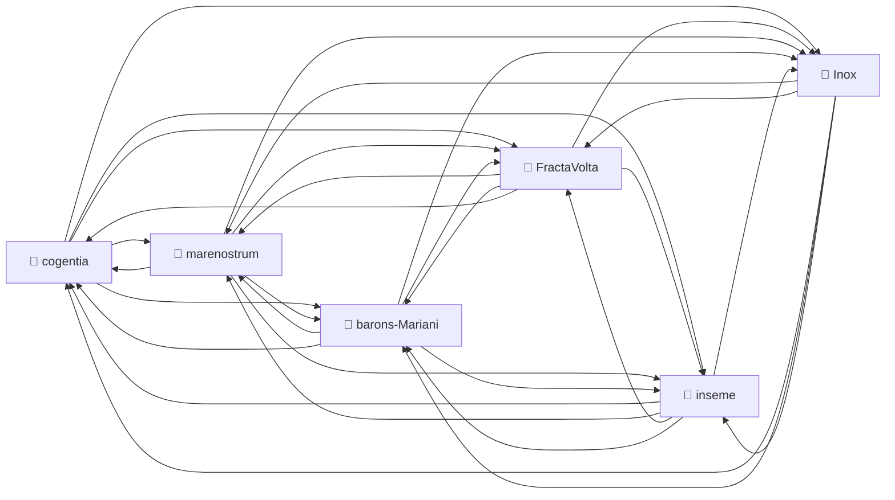

# Corpus Status — inseme

_Auto-refreshed by `cogentia.js corpus-status`. The structural sections_ — _Registered Repositories,
Cross-Reference Graph, Published, What Remains Possible_ — _are regenerated from the registry and
from [`research/index.md`](index.md) on every run._ _The substantive sections_ — _What Is Proved_
_and_ _Open Objections_ — _are manually curated and preserved across refreshes._

---

## Registered Repositories

<!-- BEGIN_AUTO: registered_repos -->

| Repository     | research/index.md | Branch | Last commit |
| -------------- | ----------------- | ------ | ----------- |
| cogentia       | ✅                | main   | 2026-05-27  |
| FractaVolta    | ✅                | main   | 2026-05-27  |
| marenostrum    | ✅                | main   | 2026-05-27  |
| barons-Mariani | ✅                | main   | 2026-05-27  |
| inseme         | ✅                | main   | 2026-05-27  |
| Inox           | ✅                | master | 2026-05-27  |

<!-- END_AUTO: registered_repos -->

---

## Cross-Reference Graph

<!-- BEGIN_AUTO: graph -->

<!-- END_AUTO: graph -->

---

## Concepts

<!-- BEGIN_AUTO: concepts -->

| Concept                                                                                | Scope | Status | Type                                                                      |
| -------------------------------------------------------------------------------------- | ----- | ------ | ------------------------------------------------------------------------- |
| [Cogentia](./concepts.md#cogentia)                                                     | —     | —      | abstract concept / agentivity class **Scope:** Global **Status:** Working |
| [Cogentigram](./concepts.md#cogentigram)                                               | —     | —      | representation / map **Scope:** Global **Status:** Working                |
| [COP (Continuous Operation Protocol)](./concepts.md#cop-continuous-operation-protocol) | —     | —      | protocol / runtime **Scope:** Global **Status:** Canonical                |
| [Briques](./concepts.md#briques)                                                       | —     | —      | modular component **Scope:** Global **Status:** Operational               |
| [Kudocracy](./concepts.md#kudocracy)                                                   | —     | —      | governance system **Scope:** Global **Status:** Defined                   |
| [Agora](./concepts.md#agora)                                                           | —     | —      | system model **Scope:** Global **Status:** Defined                        |
| [Ophélia](./concepts.md#ophelia)                                                       | —     | —      | agent **Scope:** Global **Status:** Operational                           |
| [COP Invariants](./concepts.md#cop-invariants)                                         | —     | —      | cryptographic rule **Scope:** repository-specific **Status:** Canonical   |
| [Brique Spec / Multi-Instance](./concepts.md#brique-spec-multi-instance)               | —     | —      | technical specification **Scope:** project-specific **Status:** Defined   |
| [Modular System](./concepts.md#modular-system)                                         | —     | —      | frontend architecture **Scope:** repository-specific **Status:** Working  |

<!-- END_AUTO: concepts -->

## Concept Graph

```mermaid
graph LR
  c_cogentia["Cogentia"]
  c_cogentigram["Cogentigram"]
  c_continuation_protocol["Continuation Protocol"]
  c_cogentia_commons["Cogentia Commons"]
  c_sovereign_digital_twin["Sovereign Digital Twin"]
  c_agent_resumable_cli["Agent-Resumable CLI"]
  c_kernel_extractor["Kernel Extractor"]
  c_kys_know_your_system_psychocognitive_analysis["KYS (Know Your System) / Psychocognitive Analysis"]
  c_cogentia_workflows["Cogentia Workflows"]
  c_cogentia["Cogentia"]
  c_cogentigram["Cogentigram"]
  c_ipn_inference_packet_network["IPN (Inference Packet Network)"]
  c_epn_energy_packet_network["EPN (Energy Packet Network)"]
  c_pgn_power_generation_node["PGN (Power Generation Node)"]
  c_packet_attractors["Packet Attractors"]
  c_the_unconscious_grid["The Unconscious Grid"]
  c_mariani_village["Mariani Village"]
  c_value_shaped_solar["Value-Shaped Solar"]
  c_containerized_compute_tera["Containerized Compute (Tera)"]
  c_traceable_governance["Traceable Governance"]
  c_cogentia["Cogentia"]
  c_cogentigram["Cogentigram"]
  c_dhitl_democratic_human_in_the_loop["DHITL (Democratic Human In The Loop)"]
  c_cxu_compute_and_exergy_unit["CXU (Compute and Exergy Unit)"]
  c_safe_compute_exergy["Safe Compute Exergy"]
  c_constellia["Constellia"]
  c_corsica_forest_synergies["Corsica Forest Synergies"]
  c_infrastructure_is_all_you_need["Infrastructure is All You Need"]
  c_sun_to_sovereignty["Sun to Sovereignty"]
  c_cogentia["Cogentia"]
  c_cogentigram["Cogentigram"]
  c_potentics["Potentics"]
  c_cognitive_waves["Cognitive Waves"]
  c_mimetic_desynchronization["Mimetic Desynchronization"]
  c_invidia["Invidia"]
  c_transition_markets["Transition Markets"]
  c_the_uchronian_museum["The Uchronian Museum"]
  c_possibilism["Possibilism"]
  c_territoires_possibilistes["Territoires Possibilistes"]
  c_the_second_method["The Second Method"]
  c_projet_minesteggio["Projet Minesteggio"]
  c_discret_holography["Discret Holography"]
  c_cogentia["Cogentia"]
  c_cogentigram["Cogentigram"]
  c_cop_continuous_operation_protocol["COP (Continuous Operation Protocol)"]
  c_briques["Briques"]
  c_kudocracy["Kudocracy"]
  c_agora["Agora"]
  c_ophelia["Ophélia"]
  c_cop_invariants["COP Invariants"]
  c_brique_spec_multi_instance["Brique Spec / Multi-Instance"]
  c_modular_system["Modular System"]
  c_traceable_agency["traceable agency"]
  c_traceable_agency --> c_cogentia
  c_cogentia --> c_cogentigram
  c_operational_memory["operational memory"]
  c_cogentia --> c_operational_memory
  c_map_vs_territory["map vs territory"]
  c_cogentigram -.-> c_map_vs_territory
  c_cogentigram -.-> c_operational_memory
  c_cogentigram -.-> c_traceable_agency
  c_agent_resumable_cli --> c_continuation_protocol
  c_dhitl["dhitl"]
  c_dhitl --> c_infrastructure_is_all_you_need
```

<!-- BEGIN_AUTO: concept_graph -->

<!-- END_AUTO: concept_graph -->

---

## Published in this repo

<!-- BEGIN_AUTO: published -->

| Title                                                                                                                     | Location  | Date        |
| ------------------------------------------------------------------------------------------------------------------------- | --------- | ----------- |
| [COP — Cognitive Orchestration Protocol (Architecture)](../packages/cop-core/Architecture.md) _(canonical protocol spec)_ | this repo | 2025-12     |
| [COP Invariants — non-negotiable rules of the protocol](../packages/cop-core/Invariants.md)                               | this repo | 2025-12     |
| [COP Manifesto](../packages/cop-core/Manifesto.md)                                                                        | this repo | 2025-12     |
| [COP FAQ](../packages/cop-core/FAQ.md)                                                                                    | this repo | 2025-12     |
| [COP Comparison with other orchestration frameworks](../packages/cop-core/COMPARISON.md)                                  | this repo | 2025-12     |
| [COP Roadmap](../packages/cop-core/ROADMAP.md)                                                                            | this repo | 2025-12     |
| [Modular System Architecture — the Brique pattern](../docs/MODULAR_SYSTEM.md)                                             | this repo | 2025-12     |
| [BRIQUE_SPEC — the brique manifest contract](../packages/cop-host/BRIQUE_SPEC.md)                                         | this repo | 2025-12     |
| [Multi-Instance Architecture](../packages/cop-host/docs/MULTI_INSTANCE.md)                                                | this repo | 2025-12     |
| [Corpus Status](corpus-status.md) _(living view — auto-refreshed by `cogentia.js corpus-status`)_                         | this repo | refreshable |
| [Concept Index](concepts.md) _(typed concept registry — mapped by `cogentia.js concepts`)_                                | this repo | refreshable |

<!-- END_AUTO: published -->

---

## What Is Proved

_Manually curated: claims demonstrated by the published work in this corpus._

| Claim               | Status | Evidence |
| ------------------- | ------ | -------- |
| _(add claims here)_ |        |          |

---

## Open Objections

_Manually curated: objections received publicly, not yet fully resolved._

| Objection               | Source | Status |
| ----------------------- | ------ | ------ |
| _(add objections here)_ |        |        |

---

## What Remains Possible

<!-- BEGIN_AUTO: possibilities -->

- A formal "brique developer guide" consolidating BRIQUE_SPEC + concrete examples from
- An "Ophélia mediator profile" — operational semantics of the AI mediator as it interfaces with
- A `brique-` template generator (`cogentia.js init-brique <name>` or equivalent).
<!-- END_AUTO: possibilities -->

---

_Generated with `cogentia.js corpus-status` —
[scripts/cogentia.js](https://github.com/JeanHuguesRobert/cogentia/blob/main/scripts/cogentia.js)_
_Challenge via issues. Fork to explore alternatives._

<!-- BEGIN_AUTO: backlinks -->

### Backlinks

_These documents link to this file:_

- [🏗️ Inseme Modular System Architecture](../docs/MODULAR_SYSTEM.md)
- [Cognitive Orchestration Protocol (COP)](../packages/cop-core/Architecture.md)
- [COMPARISON.md](../packages/cop-core/COMPARISON.md)
- [**FAQ.md**](../packages/cop-core/FAQ.md)
- [COP Protocol Invariants](../packages/cop-core/Invariants.md)
- [**The COP Manifesto**](../packages/cop-core/Manifesto.md)
- [ROADMAP — Cognitive Orchestration Protocol (COP)](../packages/cop-core/ROADMAP.md)
- [Spécification du Manifeste de Brique (brique.config.js)](../packages/cop-host/BRIQUE_SPEC.md)
- [Concept Index — inseme](concepts.md)
- [Corpus Status — inseme](corpus-status.md)
- [Research Index — Inseme](index.md)

<!-- END_AUTO: backlinks -->
